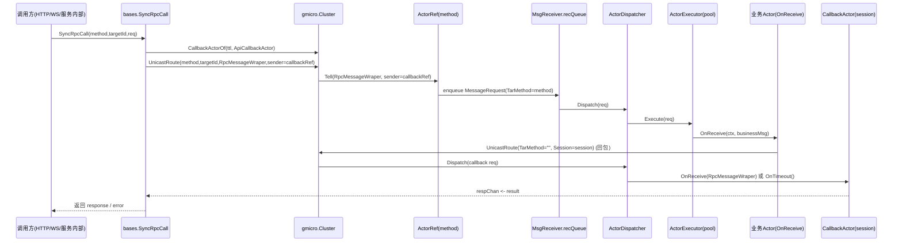

## Actor 架构说明（im-server）

本文档说明 `im-server` 的 **Actor 架构**：它是什么、由哪些组件组成、消息是怎么在组件之间流动的、以及业务侧如何注册与调用 Actor。

> 结论先行：本项目的 Actor 体系是一个 **进程内（in-process）的消息分发与并发执行框架**，以 “method 字符串” 作为路由键；并提供 “Callback Actor + 超时” 作为同步等待/请求-响应的实现基础。

---

## 1. Actor 在项目里解决什么问题

- **统一的内部调用模型**：把“调用某个服务能力”抽象为 `method + proto message` 的一次投递（Tell），而不是直接函数调用。
- **并发隔离与吞吐控制**：每个 method 对应一个执行器（线程池/worker pool），可以按业务热点单独配置并发（例如 `RegisterStandaloneActor`）。
- **支持请求-响应**：通过 Callback Actor + TTL，把异步投递变成可等待的同步调用（`bases.SyncRpcCall` / `SyncUnicastRoute`）。
- **统一上下文注入**：把路由层的 `RpcMessageWraper` 中的 AppKey、Session、RequesterId、TargetId、QoS 等统一写入 `context.Context`，供业务 actor 使用（`bases.BaseProcessActor`）。

---

## 2. 关键概念与组件（从底层到业务）

### 2.1 ActorSystem：进程内运行时

代码位置：`commons/gmicro/actorsystem/actorsystem.go`

核心职责：

- **创建 ActorRef**：
  - `ActerOf(method)` / `LocalActorOf(method)`：创建一个带 `method` 的 `ActorRef`。
  - `CallbackActerOf(ttl, actor)`：创建一个 “callback actor ref”，用于接收响应并处理超时。
- **注册 Actor**：
  - `RegisterActor(method, factory)`：注册一个 method 的执行器。
  - `RegisterStandaloneActor(method, factory, concurrentCount)`：为某个 method 单独设置并发。
  - `RegisterMultiMethodActor(methods, factory)`：多个 method 复用同一执行器。

### 2.2 ActorRef：对外的“投递入口”

代码位置：`commons/gmicro/actorsystem/actorref.go`

- **Tell**：`ActorRef.Tell(message, sender)` 会把 `proto.Message` 编码成 bytes，并封装成 `MessageRequest{ TarMethod, SrcMethod, Session, Data, ... }`。
- **TellAndNoSender**：用于不关心 sender 的 fire-and-forget。
- **CallbackActorRef**：
  - callback 的路由 **不依赖 method**：当 `TarMethod == ""` 时，表示这是给 callback actor 的投递；
  - callback actor 的 key 是 `session`（更准确：`session` 的短字符串化 key）。

> 实际上 callback actor 是用 “session 作为会话键” 来做一次性回包匹配的：收到一次响应后就从 map 中删除（一次性消费）。

### 2.3 MsgSender / MsgReceiver：收发与排队

代码位置：`commons/gmicro/actorsystem/msgsender.go`、`commons/gmicro/actorsystem/msgreceiver.go`

- `MsgSender.Send(req)` 把请求交给 `MsgReceiver.Receive(req)`。
- `MsgReceiver` 内部维护一个大缓冲队列 `recQueue`（默认 10000），后台 goroutine 持续取出并交给 dispatcher 分发。

这层的定位类似 “本地消息总线 + 队列缓冲”。

### 2.4 ActorDispatcher：路由表 + callback 表 + 超时轮

代码位置：`commons/gmicro/actorsystem/actordispatcher.go`

它维护两张表：

- **dispatchMap**：`method -> executor`
- **callbackMap**：`sessionKey -> CallbackActorExecutor`

分发规则（关键点）：

- 当 `req.TarMethod != ""`：从 `dispatchMap` 查 executor，然后执行。
- 当 `req.TarMethod == ""`：认为这是 callback 消息，用 `req.Session` 去 `callbackMap` 查 callback executor，查到后会 **LoadAndDelete**（一次性），并移除超时任务。

超时机制：

- `AddCallbackActor(session, actor, ttl)` 会把 callback executor 放入 `callbackMap`，同时在 timewheel 里注册一个 ttl 到期任务；
- 到期后若还存在，就删除并触发 `actor.OnTimeout()`。

### 2.5 ActorExecutor：并发执行器（线程池 + actor 对象池）

代码位置：`commons/gmicro/actorsystem/actorexecutor.go`

每个 method 注册后对应一个 executor（或多个 method 共享同一个 executor）。

executor 的运行模型：

- **worker pool**：使用 `tunny.Pool` 执行任务（`RegisterStandaloneActor` 可指定并发数；否则复用 dispatcher 的公共池）。
- **actorPool（sync.Pool）**：用于复用 actor 实例，减少频繁 alloc。
- **执行入口**：
  - `Execute(req)`：先把请求 decode 成 `wraper{ sender, msg, actor }` 投入 `wraperChan`；
  - 后台 goroutine 从 `wraperChan` 读取，并把执行提交给 worker pool；
  - 在 worker 中：
    - `SetSender(sender)`（如果 actor 实现了 `ISenderHandler`）
    - `OnReceive(context.Background(), msg)`（如果实现了 `IReceiveHandler`）

> 注意：这里的“actor”更像是一个 **handler 的实例池**，而不是经典 Actor 模型中“每个实体一个 mailbox 串行处理”。本实现更偏向 “method 路由 + 并发 worker + 复用 handler 实例”。

### 2.6 UntypedActor 接口族：Actor 能力拼装

代码位置：`commons/gmicro/actorsystem/untypedactor.go`

- `ICreateInputHandler.CreateInputObj()`：声明当前 actor 期望的输入 proto 类型。
- `IReceiveHandler.OnReceive(ctx, msg)`：执行业务逻辑。
- `ISenderHandler/ISelfHandler`：可选，用于拿到 sender/self。
- `ITimeoutHandler.OnTimeout()`：仅 callback actor 需要。

---

## 3. gmicro.Cluster：把 ActorSystem 暴露为“内部路由”

代码位置：`commons/gmicro/cluster.go`、`commons/bases/base.go`

`gmicro.Cluster` 是对 `ActorSystem` 的一层封装，提供：

- **注册 method**：`RegisterActor...` 会同步写入当前 node 的 methodMap。
- **路由**：
  - `UnicastRoute(method, targetId, obj, sender)`
  - `BroadcastRoute(method, obj, sender, excludeNodes)`

当前实现的 `GetTargetNode` 只返回本地 node（即 **本仓库默认是单节点/单进程的路由**），所以 `targetId` 更多是业务语义（例如用户 id / 群 id），而非分片路由。

---

## 4. bases.BaseProcessActor：业务 Actor 的统一“外壳”

代码位置：`commons/bases/baseactor.go`

业务侧大量 actor 不是直接注册 `actors.XxxActor{}`，而是注册 `bases.BaseProcessActor(&actors.XxxActor{}, serviceName)`。

这个外壳做了两件关键事情：

1. **解包**：注册进 executor 的输入类型是固定的 `pbobjs.RpcMessageWraper`，其中 `AppDataBytes` 才是真正业务 proto 的 bytes。
2. **注入上下文**：把 `RpcMessageWraper` 上的字段写入 `context.Context`（例如 `CtxKey_AppKey / Session / RequesterId / TargetId / Qos ...`），让业务 actor 可用 `bases.GetXxxFromCtx(ctx)` 读取。

简化流程：

- executor 收到 `RpcMessageWraper` -> `baseProcessActor.OnReceive`
- `baseProcessActor` 解析 `AppDataBytes` 成业务 actor 的 `CreateInputObj()` 类型
- 调用业务 actor 的 `OnReceive(ctx, businessMsg)`

---

## 5. 业务侧如何使用 Actor（注册与调用）

### 5.1 注册：每个服务在 `starter.go` 里注册 method

典型位置：

- `services/message/starter.go`
- `services/conversation/starter.go`
- 以及各 `services/*/starter.go`

常见形态：

- `RegisterActor("qry_conver", factory)`
- `RegisterStandaloneActor("msg_dispatch", factory, 6144)`：为热点 method 单独给更大并发

### 5.2 调用：通过 bases 的路由函数投递

核心入口在 `commons/bases/base.go`：

- **同步请求-响应**：`bases.SyncRpcCall` / `bases.SyncOriginalRpcCall`
  - 内部通过 `cluster.CallbackActorOf(ttl, callbackActor)` 创建 callback sender；
  - `SyncUnicastRoute` 中阻塞等待 callback actor 把响应写入 channel，或超时。
- **异步投递**：`bases.AsyncRpcCall` / `bases.UnicastRouteWithNoSender`
- **批量与广播**：`bases.GroupRpcCall`、`bases.Broadcast`

### 5.3 一个完整的“请求-响应”消息流（概念图）

（图中“回包”阶段的关键点是：callback 消息的 `TarMethod == ""`，并依赖 `session` 匹配到 callback actor。）

---

## 6. 你在代码里读 Actor 架构的推荐入口

- **运行时与路由**：
  - `commons/gmicro/actorsystem/actorsystem.go`
  - `commons/gmicro/actorsystem/actorref.go`
  - `commons/gmicro/actorsystem/actordispatcher.go`
  - `commons/gmicro/actorsystem/actorexecutor.go`
  - `commons/gmicro/cluster.go`
- **业务外壳与上下文**：
  - `commons/bases/baseactor.go`
  - `commons/bases/base.go`
- **业务 method 注册表（理解“有哪些 actor”）**：
  - `services/*/starter.go`
- **一个业务 actor 的样例**：
  - `services/message/actors/msgdispatchactor.go`（输入 `pbobjs.DownMsg`，在 `OnReceive` 里调用业务服务）

---

## 7. 与传统 Actor 模型的差异（避免误解）

为了避免把它当成 Akka/Proto.Actor 那种 “每个 actor 一个 mailbox 串行” 的模型，这里明确本实现的几个特征：

- **路由粒度是 method（字符串）**，不是“actor id / actor path”。
- **并发模型是 worker pool**：同一 method 可能并发执行很多条消息（取决于 pool 并发数），不保证同一 `targetId` 串行。
- **handler 实例通过 sync.Pool 复用**，更像高性能 RPC handler。
- **Callback Actor 是一次性回包容器**：基于 session 做匹配，并配合 timewheel 处理超时。

如果你后续希望实现“同一用户/同一会话严格串行”，需要在 method 粒度之上再引入：

- 以 `(method,targetId)` 为 key 的分片/一致性 hash 到固定 worker；
- 或者为每个 target 建立独立 mailbox（经典 actor 形态）。

